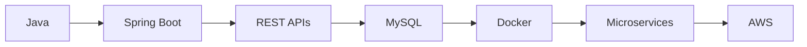

<div align="center">

# Hi 👋, I'm Abhishek

### Backend Engineer | Java • Spring Boot • REST APIs • MySQL

<p>
<a href="mailto:abhishekkashyap2501@gmail.com">

</a>

<a href="https://www.linkedin.com/in/k-abhishek2501">

</a>

<a href="https://github.com/kabhi2004">

</a>

<a href="https://github.com/kabhi2004?tab=followers">

</a>

</p>


</div>

---

# 👨‍💻 About Me

Backend Developer passionate about building scalable, secure, and maintainable backend applications using Java and the Spring ecosystem.

- 🔭 Building RESTful backend services
- 🌱 Learning Spring Security, Microservices & System Design
- 💡 Interested in Distributed Systems and Cloud Technologies
- 💻 Strong in Java, OOP, Collections and DSA
- 🚀 Always exploring modern backend engineering practices

---

# 💼 Developer Profile

| | |
|:---|:---|
| **Role** | Backend Engineer |
| **Primary Language** | Java |
| **Framework** | Spring Boot |
| **Database** | MySQL, MongoDB |
| **Architecture** | REST APIs, Layered Architecture |
| **Learning** | Microservices, Docker, AWS |
| **Focus** | Clean Code & Scalable Systems |

---

# 🛠 Tech Stack

### Languages

<p>

</p>

### Backend

<p>

</p>

### Database

<p>

</p>

### Tools & DevOps

<p>

</p>

---

# 🧠 Engineering Principles

- Clean Code
- SOLID Principles
- REST API Design
- Design Patterns
- Layered Architecture
- Performance Optimization
- Secure Development
- Continuous Learning

---

# 🚀 Featured Project

## Facial Recognition Attendance System

A production-inspired attendance management platform powered by Computer Vision.

### Tech Stack

- Python
- FastAPI
- React
- OpenCV
- KNN
- MySQL

### Features

- 🎯 Real-time Face Recognition
- 👨‍🎓 Student Dashboard
- 👨‍🏫 Faculty Dashboard
- 👨‍💼 Admin Dashboard
- 📊 Attendance Analytics
- 🔒 Authentication
- ⚡ REST APIs
- 🗄️ MySQL Database

<p>

<a href="https://github.com/kabhi2004/Facial-Recognition-Attendance-System">

</a>

</p>

---

# 📊 GitHub Analytics

<p align="center">


</p>

<p align="center">


</p>

---

# 📚 Currently Learning

- Spring Security
- JWT Authentication
- Microservices
- Redis
- Docker
- Kubernetes
- AWS
- System Design

---

# 🗺️ Learning Roadmap

```text
✅ Core Java
✅ Object-Oriented Programming
✅ Collections Framework
✅ Data Structures & Algorithms
✅ SQL & MySQL
✅ REST APIs
🔄 Spring Security
🔄 Docker
🔄 Redis
🔄 Microservices
🔄 Kubernetes
🔄 AWS
🔄 System Design
```

---

# 📈 Backend Architecture Journey



---

# 🎯 2026 Goals

- Build Production Ready Backend Applications
- Master Spring Boot Ecosystem
- Learn Distributed Systems
- Deploy Applications on AWS
- Contribute to Open Source
- Improve System Design Skills

---

# 🌐 Connect With Me

<p align="center">

<a href="mailto:abhishekkashyap2501@gmail.com">

</a>

<a href="https://www.linkedin.com/in/k-abhishek2501">

</a>

<a href="https://github.com/kabhi2004">

</a>

</p>

---

<div align="center">

### 💬 Quote

> **"First, solve the problem. Then, write the code."**  
> — John Johnson

---

⭐ **Thanks for visiting my profile!**

If you like my projects, don't forget to ⭐ them.

🚀 Happy Coding!

</div>

